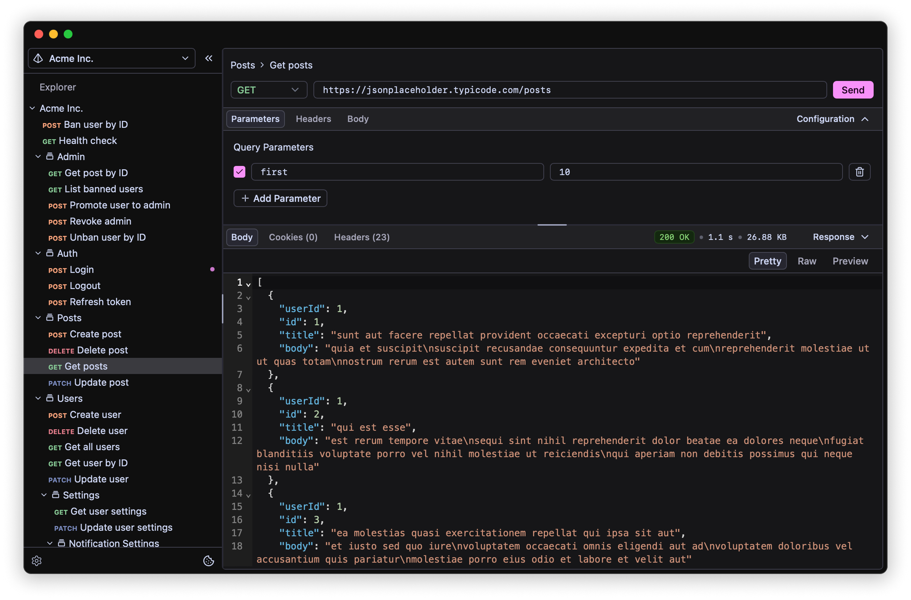

<br>

<p align="center">
    
</p>

<p align="center">
  <a href="https://zaku.app" target="_blank">
    <picture>
      <source media="(prefers-color-scheme: dark)" srcset="./assets/zaku-dark.svg">
      <source media="(prefers-color-scheme: light)" srcset="./assets/zaku-light.svg">
      
    </picture>
  </a>
</p>

<h5 align="center">Fast, open-source API client with fangs</h5>

<p align="center">
    <a href="https://github.com/buildzaku/zaku/actions/workflows/release.yml" target="_blank"></a>
    <a href="https://github.com/buildzaku/zaku/releases/latest" target="_blank"></a>
    <a href="https://github.com/buildzaku/zaku/blob/main/LICENSE.md" target="_blank"></a>
</p>

<p align="center">
  
</p>

> [!WARNING]
> Zaku is in early stages of development, expect breaking changes.

<h2>Installation</h2>

<h4>
  <picture>
    <source media="(prefers-color-scheme: dark)" srcset="./assets/apple-dark.svg">
    <source media="(prefers-color-scheme: light)" srcset="./assets/apple-light.svg">
    
  </picture>
  <span>macOS</span>
</h4>

Download for [Arm (Apple Silicon)](https://github.com/buildzaku/zaku/releases/latest/download/zaku-aarch64-apple-darwin.dmg) or [x86 (Intel)](https://github.com/buildzaku/zaku/releases/latest/download/zaku-x86_64-apple-darwin.dmg)

After installing, run this command from your terminal:

```sh
xattr -c /Applications/Zaku.app
```

This is required because Zaku is not code signed yet. [Read more](https://discussions.apple.com/thread/253714860)

<h4>
  <picture>
    <source media="(prefers-color-scheme: dark)" srcset="./assets/linux-dark.svg">
    <source media="(prefers-color-scheme: light)" srcset="./assets/linux-light.svg">
    
  </picture>
  <span>Linux</span>
</h4>

Download the [.deb package](https://github.com/buildzaku/zaku/releases/latest/download/zaku-x86_64-unknown-linux-gnu.deb) for x86 Ubuntu/Debian

From your terminal, navigate to the download location and run:

```sh
sudo apt install ./zaku-x86_64-unknown-linux-gnu.deb
```

Or install via Snap:

```sh
sudo snap install zaku
```

<h4>
  <picture>
    <source media="(prefers-color-scheme: dark)" srcset="./assets/microsoft-dark.svg">
    <source media="(prefers-color-scheme: light)" srcset="./assets/microsoft-light.svg">
    
  </picture>
  <span>Windows</span>
</h4>

Download the [.exe file](https://github.com/buildzaku/zaku/releases/latest/download/zaku-x86_64-pc-windows-msvc.exe) or [MSI package](https://github.com/buildzaku/zaku/releases/latest/download/zaku-x86_64-pc-windows-msvc.msi)

Launch the installer and follow the prompts.

## Contributing

Checkout the [contributing guide](./.github/CONTRIBUTING.md).

## License

Zaku is licensed under the [MIT license](./LICENSE.md).
