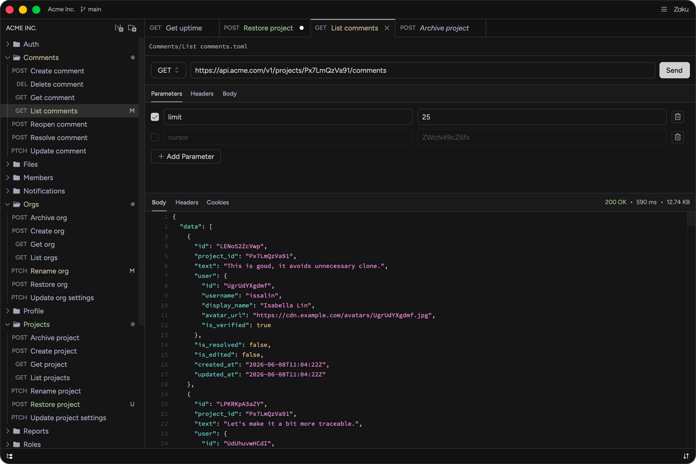

<h1 align="center">
  
  <br>
  <span>Zaku</span>
</h1>
<p align="center">Fast, open-source API client with fangs.</p>
<p align="center">
  
</p>

> [!WARNING]
> Zaku is currently in beta. Expect some rough edges.

## Installation

<h3>
  <picture>
    <source media="(prefers-color-scheme: dark)" srcset="./assets/readme/linux_dark.svg">
    <source media="(prefers-color-scheme: light)" srcset="./assets/readme/linux_light.svg">
    
  </picture>
  <span>Linux</span>
</h3>

Install using the shell script:

```sh
curl -fsSL https://raw.githubusercontent.com/buildzaku/zaku/main/script/install.sh | sh -s -- --channel beta
```

<h3>
  <picture>
    <source media="(prefers-color-scheme: dark)" srcset="./assets/readme/apple_dark.svg">
    <source media="(prefers-color-scheme: light)" srcset="./assets/readme/apple_light.svg">
    
  </picture>
  <span>macOS</span>
</h3>

Download the DMG for [Apple silicon](https://api.zaku.dev/releases/beta/latest/macos-aarch64/download) or [Intel](https://api.zaku.dev/releases/beta/latest/macos-x86_64/download). Requires macOS 14 or later.

After copying Zaku to Applications, open Terminal and run:

```sh
xattr -dr com.apple.quarantine /Applications/Zaku.app
```

This is required because Zaku isn't signed yet. Otherwise, macOS will refuse to open the app.

<h3>
  <picture>
    <source media="(prefers-color-scheme: dark)" srcset="./assets/readme/microsoft_dark.svg">
    <source media="(prefers-color-scheme: light)" srcset="./assets/readme/microsoft_light.svg">
    
  </picture>
  <span>Windows</span>
</h3>

Download the installer for [ARM64](https://api.zaku.dev/releases/beta/latest/windows-aarch64/download) or [x64](https://api.zaku.dev/releases/beta/latest/windows-x86_64/download). Requires Windows 11.

The installer is not signed yet. If Microsoft Defender SmartScreen appears, select **More info**, then **Run anyway**.

#### License

<sup>
Licensed under the <a href="LICENSE">GNU Affero General Public License,
Version 3.0 or later</a>.
</sup>
<br>
<sup>
Any contribution intentionally submitted for inclusion in this repository by
you shall be licensed under the GNU Affero General Public License, Version 3.0
or later, without any additional terms or conditions.
</sup>
